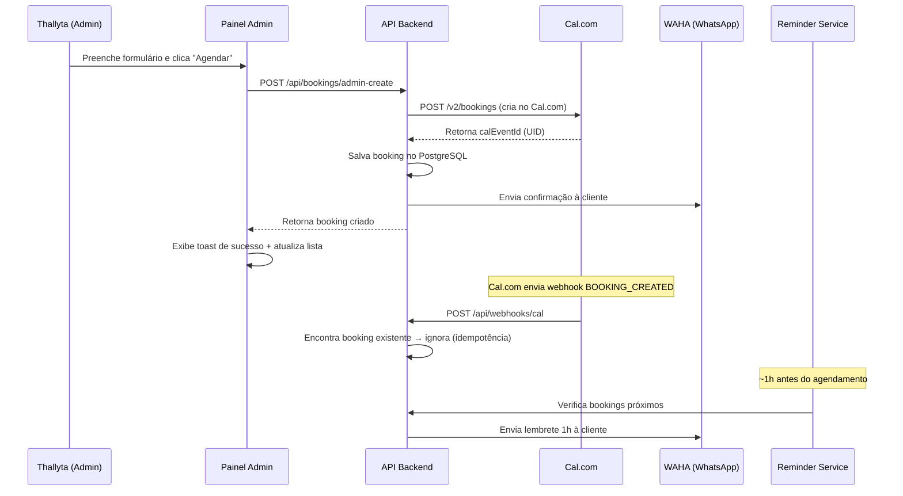

# Agendamento Manual pela Administradora (Novo Agendamento)

Permitir que a administradora (Thallyta) crie agendamentos diretamente pelo Painel Admin, preenchendo os dados da cliente. O agendamento será criado **simultaneamente** no Cal.com (aparecendo na agenda) e no banco de dados do sistema — mantendo todas as funcionalidades (WhatsApp, lembrete 1h antes, fidelidade, financeiro).

## User Review Required

> [!IMPORTANT]
> **Sem pagamento Mercado Pago**: Agendamentos criados manualmente pela admin **não passam pelo fluxo de pagamento**. O `BookingPayment` não será criado. Tudo certo?

> [!IMPORTANT]
> **Qual "event type" do Cal.com usar?** Atualmente, cada serviço tem um `calUrl` diferente (ex: `alongamento-em-gel`, `servicos-gerais`, `remocao`). Para simplificar, vamos usar o slug genérico `servicos-gerais` (que é o `30min` configurado no `.env.local`) para todos os agendamentos manuais. Assim o horário fica bloqueado na agenda sem precisar mapear cada serviço a um event type. Aceita?

## Proposed Changes

### Backend — Serviço Cal.com

#### [NEW] [calService.js](file:///c:/Users/Public/site-thallyta/backend/src/services/calService.js)

Serviço reutilizável para interagir com a API do Cal.com v2:
- `getEventTypeId(slug)` — Busca o ID numérico de um event type pelo slug (necessário para a API de criação)
- `createCalBooking({ eventTypeId, start, attendeeName, attendeeEmail, metadata })` — Cria um booking no Cal.com via `POST /v2/bookings`
- Usa as mesmas env vars já existentes (`CAL_API_KEY`, `CAL_USERNAME`)
- Inclui `metadata: { adminCreated: true }` para identificar agendamentos manuais

---

### Backend — Controller de Booking

#### [MODIFY] [bookingController.js](file:///c:/Users/Public/site-thallyta/backend/src/controllers/bookingController.js)

Adicionar função `createAdminBooking`:
- **Endpoint**: `POST /api/bookings/admin-create`
- **Acesso**: Apenas ADMIN
- **Campos do body**:
  - `attendeeName` (obrigatório) — Nome da cliente
  - `attendeePhone` (obrigatório) — WhatsApp da cliente (para notificações)
  - `attendeeEmail` (opcional) — Email da cliente
  - `serviceId` (obrigatório) — ID do serviço (ex: `gel`, `manutencao`)
  - `date` (obrigatório) — Data no formato `YYYY-MM-DD`
  - `time` (obrigatório) — Horário no formato `HH:MM`
  - `notes` (opcional) — Observações
- **Fluxo**:
  1. Valida campos obrigatórios
  2. Busca preço do serviço no catálogo backend (`services.js`)
  3. Converte data/hora de Fortaleza para UTC
  4. Cria booking no Cal.com via `calService.createCalBooking()`
  5. Salva no banco com `calEventId` retornado pelo Cal.com
  6. Tenta associar ao User pelo email (se fornecido)
  7. Envia notificação WhatsApp à cliente (via `notifyBookingCreated` existente)
  8. Retorna o booking criado

---

### Backend — Webhook (Proteção contra duplicata)

#### [MODIFY] [webhookController.js](file:///c:/Users/Public/site-thallyta/backend/src/controllers/webhookController.js)

Na função `handleBookingCreated`:
- **Após** a verificação de idempotência (que já pula duplicatas), adicionar verificação de `metadata.adminCreated`
- Se `payload.metadata?.adminCreated === true`, pular a validação de pagamento e não cancelar o booking
- Isso garante que, caso o webhook chegue ANTES do backend salvar no DB (race condition), o booking não será cancelado

```diff
  // Verifica se já existe (idempotência)
  const existing = await prisma.booking.findUnique({ where: { calEventId: uid } });
  if (existing) {
    console.log(`ℹ️ Booking ${uid} já existe. Ignorando duplicata.`);
    return;
  }

+ // Agendamento criado manualmente pela admin — pula validação de pagamento
+ if (payload.metadata?.adminCreated === true) {
+   console.log(`ℹ️ Booking ${uid} criado pela admin. Registrando sem pagamento.`);
+   // Cria o booking no banco sem exigir pagamento
+   // (código de criação similar ao existente, sem paymentId)
+   return;
+ }

  const bookingPaymentId = payload.metadata?.bookingPaymentId;
```

---

### Backend — Rotas

#### [MODIFY] [bookingRoutes.js](file:///c:/Users/Public/site-thallyta/backend/src/routes/bookingRoutes.js)

Adicionar a nova rota:
```diff
+ import { createAdminBooking } from '../controllers/bookingController.js';
  ...
+ router.post('/admin-create', verifyToken, verifyAdmin, createAdminBooking);
```

---

### Frontend — Painel Admin

#### [MODIFY] [AdminPanel.jsx](file:///c:/Users/Public/site-thallyta/src/components/admin/AdminPanel.jsx)

Adicionar modal de "Novo Agendamento" acessível pela aba **Agenda**:

1. **Botão "＋ Novo Agendamento"** — Ao lado dos botões Lista/Calendário na aba Agenda
2. **Modal com formulário**:
   - **Nome da Cliente** (texto, obrigatório)
   - **WhatsApp** (tel, obrigatório, com máscara `(XX) XXXXX-XXXX`)
   - **Email** (email, opcional)
   - **Serviço** (select/dropdown com todos os serviços e preços)
   - **Data** (date input, mínimo = hoje)
   - **Horário** (select com os time slots: 09:00, 09:45, 10:30, 11:15, 13:30, 14:15, 15:00, 15:45)
   - **Observações** (textarea, opcional)
   - **Valor** (exibido automaticamente ao selecionar serviço, read-only)
3. **Botão "Agendar"** — Envia `POST /api/bookings/admin-create`, mostra toast de sucesso, fecha modal e recarrega lista de bookings
4. **Design**: Segue o mesmo padrão visual glassmorphism escuro do resto do AdminPanel

---

## Verificação

### Como funciona o fluxo completo:



### Verification Plan

#### Automated Tests
- O backend será testado com chamadas manuais via curl/Postman ao endpoint `POST /api/bookings/admin-create`

#### Manual Verification
1. Abrir o painel admin → aba Agenda → clicar "Novo Agendamento"
2. Preencher dados de teste e agendar
3. Verificar que o agendamento aparece na lista do sistema
4. Verificar que o agendamento aparece na agenda do Cal.com
5. Verificar que a notificação WhatsApp foi enviada (se WHATSAPP_ENABLED=true)
6. Verificar que o lembrete 1h antes funciona (se BOOKING_REMINDER_ENABLED=true)
